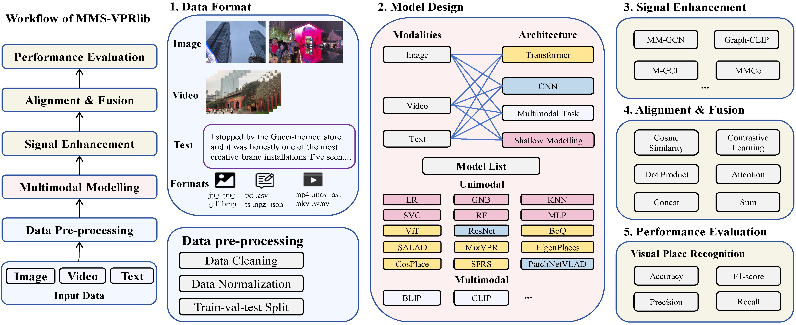
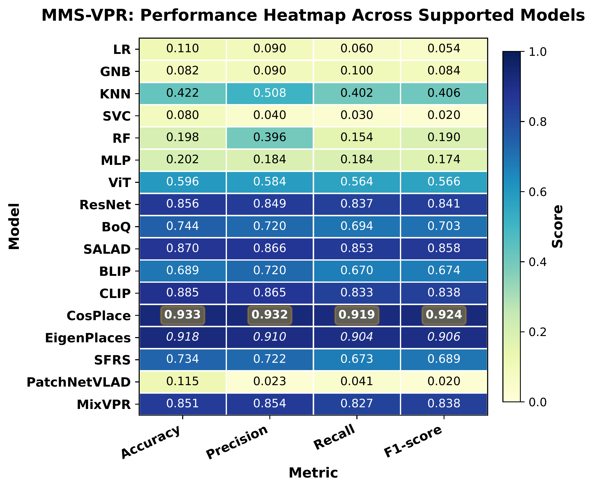
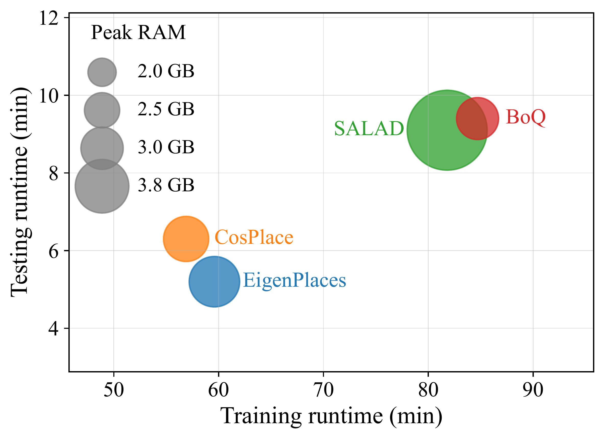
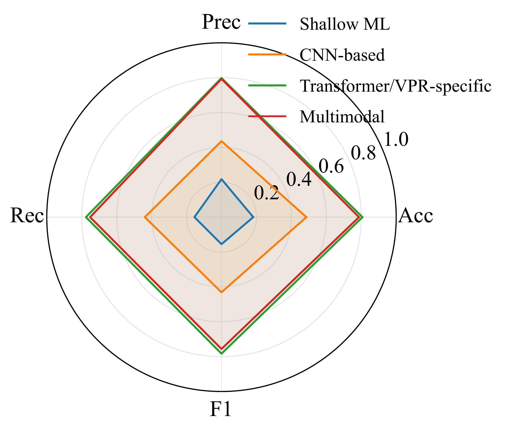
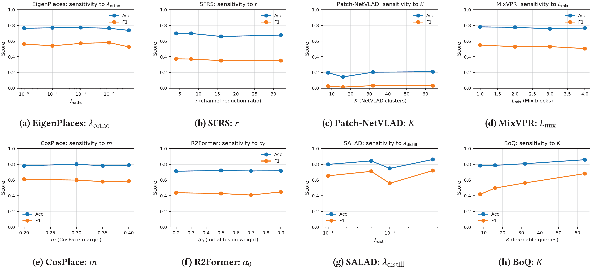

# MMS-VPRlib: Multimodal Street-Level VPR Library

[](https://arxiv.org/abs/2505.12254)
[](https://huggingface.co/datasets/Yiwei-Ou/MMS-VPR)
[](https://creativecommons.org/licenses/by/4.0/)
[](https://www.python.org/)
[](https://pytorch.org/)

**MMS-VPRlib** is a unified open-source benchmarking library for multimodal street-level Visual Place Recognition (VPR). It consolidates state-of-the-art VPR datasets and 17+ baseline models—spanning shallow ML, CNN, Transformer, vision-language, and graph-based architectures—under a standardized, reproducible evaluation pipeline. Beyond traditional image-only paradigms, MMS-VPRlib natively supports **image, video, and text** modalities, enabling systematic exploration of multimodal fusion strategies.

> **Dataset**: The MMS-VPR dataset (110,529 images, 2,527 videos, 208 locations) is hosted separately on [Hugging Face](https://huggingface.co/datasets/Yiwei-Ou/MMS-VPR). MMS-VPRlib also supports other VPR datasets, such as Pittsburgh, Tokyo 24/7, Nordland, New College, and Cambridge.

---

## System Overview

MMS-VPRlib implements a modular end-to-end pipeline covering data ingestion, pre-processing, signal enhancement, multimodal alignment, fusion, and standardized evaluation.

<!-- Workflow diagram: place Workflow-MMSVPRlib.png in the repo's images/ folder and it will render here -->


*Workflow of MMS-VPRlib — from multimodal data input through pre-processing, signal enhancement, alignment & fusion, to standardized evaluation.*

---

## Key Features

- 🔁 **Unified Pipeline**: Standardized data loading, preprocessing, training, and evaluation across 10+ VPR datasets
- 🔧 **Modular Architecture**: Plug-and-play components for signal enhancement, alignment, and feature-level / score-level fusion
- 📐 **17+ Baselines**: Covers shallow ML, CNN, Transformer, vision-language (CLIP, BLIP), and graph-based (GCN, GAT, HGNN) methods
- 📷 **Multimodal**: Native support for image, video, and text inputs—go beyond image-only VPR
- 📊 **Reproducible Benchmarking**: Fixed splits, hyperparameter configs, and detailed runtime/memory reporting
- 🏙️ **New Dataset**: First-class support for MMS-VPR — the first pedestrian-only, day-night, multimodal VPR dataset with a 7-year temporal span

---

## Quick Start

```bash
git clone https://github.com/yiasun/MMS-VPRlib.git
cd MMS-VPRlib
pip install -r requirements.txt
```

Run a model:

```bash
python run.py --model resnet --batch_size 32 --num_epochs 50
```

---

## Project Structure

```
MMS-VPRlib/
├── README.md
├── requirements.txt
├── run.py                        # Main entry point
├── sample_data_texts.xlsx        # Text modality data
├── models/                       # All model implementations
├── scripts/
│   └── classification/           # Training & evaluation scripts
└── raw/                          # Image data root (see Dataset Setup below)
```

> Pretrained language models are downloaded automatically at runtime. The default image root used in the code is `../raw`.

---

## Dataset Setup

### Image Data

Organize images in class-labeled subdirectories under `raw/`:

```
raw/
├── Class_A/
│   ├── image1.jpg
│   └── image2.jpg
├── Class_B/
│   └── image1.jpg
└── ...
```

For the **MMS-VPR dataset** specifically, image folders follow the location encoding scheme (e.g., `N-1-1/`, `Eh-1-1/`, `Ev-1-1/`, `S-1/`). Download from [Hugging Face](https://huggingface.co/datasets/Yiwei-Ou/MMS-VPR).

### Text Data

Textual annotations are provided in `sample_data_texts.xlsx`:

| Column Name | Description |
|---|---|
| Type | Category of the record |
| Primary Class (Merged) | Merged primary class label |
| Code | Unique identifier code |
| Location in the Map | Geographic location reference |
| Index | Numeric index |
| List of Store Names | Comma-separated list of store names |

---
## Supported Models

### Classical Machine Learning

| Model | Key |
|-------|-----|
| Logistic Regression | `lr` |
| Support Vector Classifier | `svc` |
| Random Forest | `rf` |
| K-Nearest Neighbours | `knn` |
| Gaussian Naïve Bayes | `gnb` |
| Multi-Layer Perceptron | `mlp` |

### Deep Visual Encoders

| Model | Key |
|-------|-----|
| ResNet | `resnet` |
| Vision Transformer (ViT) | `vit` |

### Vision-Language Pretrained Models

| Model | Key |
|-------|-----|
| CLIP | `clip` |
| BLIP | `blip` |

### VPR-Specific Architectures

| Model | Key |
|-------|-----|
| BoQ | `boq` |
| SALAD | `salad` |
| CosPlace | `cosplace` |
| EigenPlaces | `eigenplaces` |
| MixVPR | `mixvpr` |
| Patch-NetVLAD | `patchnetvlad` |
| SFRS | `sfrs` |
| R2Former | `r2former` |

### Graph-Based and Multimodal Models

| Model | Key |
|-------|-----|
| GCN | `gcn` |
| GAT | `gat` |
| HGNN | `hgnn` |
| ResNet + HGNN | `resnet_hgnn` |

---

## Supported Datasets

MMS-VPRlib unifies data loading and evaluation protocols across diverse VPR benchmarks:

| Dataset | Scene Type |
|---|---|
| **MMS-VPR** (ours) | Pedestrian-only commercial district, day-night, multimodal |
| Pittsburgh | Urban street-level (vehicle) |
| Tokyo 24/7 | Urban street-level, day-night |
| New College | Campus pedestrian |
| Nordland | Railway, seasonal change |
| Cambridge | Structured indoor/outdoor |
| CityPlace | Dense urban |

---

## Experimental Results

### Performance on MMS-VPR (Multimodal Dataset)



*Model performances on the MMS-VPR dataset (Accuracy, Precision, Recall, F1). Results are reported as mean values.*

Key findings:
- **CosPlace** leads with Accuracy: 0.933, F1: 0.924, demonstrating that VPR-oriented metric learning provides clear gains over generic visual feature extraction
- **CLIP** achieves Accuracy 0.885, a 48.5% improvement over plain ViT (0.596), highlighting the value of large-scale vision-language pretraining
- **VPR-specific Transformer models** consistently outperform classical CNN and shallow baselines

### Performance on Unimodal Datasets

Performance comparison across five standard VPR datasets (**bold** = best, *italic* = second-best per column):

| Model | Tokyo Acc | New College Acc | Pittsburgh Acc | Nordland Acc | Cambridge Acc |
|---|:-:|:-:|:-:|:-:|:-:|
| PatchNetVLAD | 0.846 | 0.144 | 0.870 | 0.430 | 0.569 |
| R2Former | 0.771 | 0.722 | 0.910 | 0.710 | 0.946 |
| ViT | 0.606 | 0.641 | 0.701 | 0.523 | 0.815 |
| SFRS | 0.579 | 0.659 | 0.880 | 0.150 | 0.959 |
| BLIP | 0.674 | 0.686 | 0.761 | 0.583 | 0.818 |
| MixVPR | 0.789 | 0.758 | 0.904 | 0.730 | 0.971 |
| EigenPlaces | *0.927* | 0.773 | **0.920** | 0.681 | 0.968 |
| ResNet | 0.794 | 0.775 | 0.879 | **0.861** | 0.968 |
| CosPlace | 0.816 | 0.781 | 0.900 | 0.560 | 0.974 |
| CLIP | 0.843 | *0.790* | 0.901 | 0.742 | 0.930 |
| BoQ | **0.975** | 0.787 | *0.920* | *0.817* | *0.984* |
| SALAD | 0.804 | **0.844** | 0.611 | 0.744 | **0.987** |

Key findings: **BoQ** achieves the strongest and most consistent results across datasets. **SALAD** excels on New College and Cambridge. Transformer-based and multimodal approaches consistently outperform traditional CNN baselines.

### Efficiency and Performance Trade-offs

<table>
<tr>
<td></td>
<td></td>
</tr>
<tr>
<td align="center"><em>Runtime–memory cost (bubble area ∝ peak RAM)</em></td>
<td align="center"><em>Category-level performance (mean over models)</em></td>
</tr>
</table>

Key findings: **CosPlace** and **EigenPlaces** achieve strong accuracy with modest runtime and peak RAM — good defaults under compute constraints. **SALAD** incurs the highest memory cost (3.8 GB). Transformer/VPR-specific methods dominate performance but require greater computational resources.


---
### Hyperparameter Sensitivity Analysis



*Sensitivity of representative VPR models to key hyperparameters. Each subplot shows Accuracy and F1 versus a model-specific hyperparameter.*

Summary of stable operating ranges:

| Model | Hyperparameter | Stable Range / Best Value |
|-------|---------------|--------------------------|
| EigenPlaces | λ_ortho | [1e-3, 1e-2] |
| SFRS | r (channel reduction) | 4–8 |
| Patch-NetVLAD | K (clusters) | 32–64 (marginal gains) |
| MixVPR | L_mix (Mix blocks) | 1 (shallow design) |
| CosPlace | m (CosFace margin) | 0.2–0.3 |
| R2Former | α₀ | Low sensitivity |
| SALAD | λ_distill | 5×10⁻³ |
| BoQ | K (queries) | 64 |

---

## Running Experiments

Basic usage:

```bash
python run.py --model lr --num_epochs 20
python run.py --model resnet --batch_size 32 --num_epochs 50
python run.py --model clip --batch_size 32 --num_epochs 30
```

Pretrained language models (for CLIP, BLIP, BERT-based methods) are downloaded automatically at runtime.

---

## Evaluation Metrics

All models are evaluated using:

| Metric | Description |
|--------|-------------|
| Accuracy | Overall classification accuracy |
| Precision | Weighted precision across classes |
| Recall | Weighted recall across classes |
| F1-score | Weighted harmonic mean of precision and recall |

---

## Dependencies

| Package | Minimum Version |
|---------|----------------|
| pillow | 8.0.0 |
| numpy | 1.19.0 |
| pandas | 1.1.0 |
| scikit-learn | 0.24.0 |
| torch | 1.8.0 |
| torch-geometric | 2.0.0 |
| transformers | 4.6.0 |
| matplotlib | 3.3.0 |
| seaborn | 0.11.0 |

```bash
pip install -r requirements.txt
```

---

## Computational Requirements

Hardware: An NVIDIA GPU with ≥8 GB VRAM (e.g., RTX 3060/4060 or equivalent) is sufficient to reproduce all reported results.

---

## Citation

If you use MMS-VPRlib or the MMS-VPR dataset in your research, please cite:

```bibtex
@misc{ou2025mmsvpr,
  title        = {MMS-VPR: Multimodal Street-Level Visual Place Recognition Dataset and Benchmark},
  author       = {Ou, Yiwei and Ren, Xiaobin and Sun, Ronggui and Gao, Guansong and Zhao, Kaiqi and Manfredini, Manfredo},
  year         = {2025},
  eprint       = {2505.12254},
  archivePrefix= {arXiv},
  primaryClass = {cs.CV},
  url          = {https://arxiv.org/abs/2505.12254}
}
```

---

## Related Resources

| Resource | Link |
|---|---|
| 📄 Paper (arXiv) | [arxiv.org/abs/2505.12254](https://arxiv.org/abs/2505.12254) |
| 🗃️ Dataset (Hugging Face) | [Yiwei-Ou/MMS-VPR](https://huggingface.co/datasets/Yiwei-Ou/MMS-VPR) |
| 💻 This Benchmark | [yiasun/MMS-VPRlib](https://github.com/yiasun/MMS-VPRlib) |

---

## Contact

For questions, issues, or collaboration:

- **GitHub Issues**: [Open an issue](https://github.com/yiasun/MMS-VPRlib/issues)
- **Email**: rsun155@aucklanduni.ac.nz
